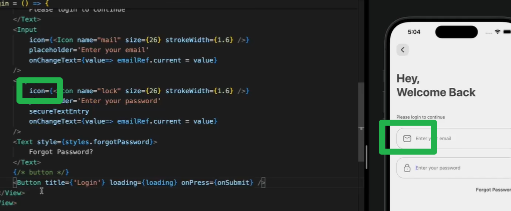

我先把 React Native 里“输入框”分成两块讲：**TextInput（核心）** + **（可选）第三方封装/表单库**。下面这份就是你要的 **属性使用大全 + 知识点大全**，按“开发常用程度”给你整理，直接能当速查表用。

---

# 1) TextInput 是什么？（核心知识点）

* RN 里没有 HTML 的 `<input />`，对应组件是 **`TextInput`**
* 既能做：普通输入、密码、搜索框、多行文本、数字输入、验证码输入
* 两种使用方式：

  * **受控（推荐）**：`value + onChangeText`
  * **非受控**：`defaultValue` 或 `ref` 取值（少用）

---

# 2) 最推荐的写法：受控输入（必会）

```tsx
import React, { useState } from "react";
import { View, TextInput, Text } from "react-native";

export default function Demo() {
  const [text, setText] = useState("");

  return (
    <View style={{ padding: 16 }}>
      <TextInput
        value={text}
        onChangeText={setText}
        placeholder="请输入..."
        style={{ borderWidth: 1, padding: 12, borderRadius: 8 }}
      />
      <Text style={{ marginTop: 12 }}>当前：{text}</Text>
    </View>
  );
}
```

✅ 优点：状态唯一来源，验证/提交/清空都方便
⚠️ 注意：只要你传了 `value`，就必须正确更新它，否则输入会“卡住”。

---

# 3) 常用属性大全（按分类）

## A. 值与变化（最重要）

* `value: string`：受控值
* `defaultValue: string`：非受控初始值
* `onChangeText: (text) => void`：文本变化回调（最常用）
* `onChange: (event) => void`：更底层的事件（少用）

> 实战建议：**业务里几乎只用 `onChangeText`**。

---

## B. 占位/提示/只读/编辑开关

* `placeholder: string`：占位提示
* `placeholderTextColor: string`
* `editable: boolean`：是否可编辑（false 类似只读）
* `readOnly`：RN 新版本逐步支持（兼容性看版本；一般用 `editable={false}` 更稳）
* `selectTextOnFocus: boolean`：聚焦时全选（适合“复制/编辑”场景）

---

## C. 键盘与输入类型（非常常用）

* `keyboardType`：键盘类型
  常见：

  * `"default"`
  * `"number-pad"` / `"numeric"`
  * `"decimal-pad"`
  * `"phone-pad"`
  * `"email-address"`
  * `"url"`
  * `"ascii-capable"`（某些登录名）
* `returnKeyType`：键盘右下角按钮文本/行为
  常见：`"done" | "go" | "next" | "search" | "send"`
* `onSubmitEditing`：按回车/搜索触发（常用）
* `blurOnSubmit`：提交后是否自动失焦

  * 单行输入一般 true（默认）
  * 多行一般要设 false

---

## D. 安全与敏感输入（密码必看）

* `secureTextEntry: boolean`：密码模式（隐藏字符）
* `textContentType`（iOS）：系统识别内容类型，影响自动填充
  例如：`"username" | "password" | "emailAddress" | "oneTimeCode"`
* `autoComplete`（Android/部分平台）：自动填充类型
  例如：`"email" | "password" | "name" | "tel"`
* `importantForAutofill`（Android）：控制自动填充优先级

> 登录/注册体验做得好不好，很大部分靠这些属性。

---

## E. 自动更正/大小写/智能输入（细节体验）

* `autoCorrect: boolean`：自动纠错（中文一般影响不大）
* `autoCapitalize`：自动大写

  * `"none" | "sentences" | "words" | "characters"`
* `spellCheck: boolean`：拼写检查（英语场景）
* `keyboardAppearance`（iOS）：`"default" | "light" | "dark"`

---

## F. 限制输入（非常实用）

* `maxLength: number`：最大长度（验证码、昵称常用）
* `inputMode`：更现代的输入模式（web 类似）部分平台支持
* **更强限制通常靠代码实现**（比如只允许数字、去空格等）

例：只允许数字

```js
onChangeText={(t) => setText(t.replace(/\D/g, ""))}
```

---

## G. 多行文本（做备注/简介）

* `multiline: boolean`
* `numberOfLines: number`（Android 更明显）
* `textAlignVertical: "top" | "center" | "bottom"`（Android 多行垂直对齐常用）
* `scrollEnabled: boolean`（多行内容是否可滚动）

---

## H. 焦点控制与键盘联动（进阶常用）

* `autoFocus: boolean`：进入页面自动聚焦
* `onFocus` / `onBlur`：聚焦/失焦（做边框高亮、校验提示）
* `ref` + `focus()` / `blur()`：代码控制焦点
* `onKeyPress`：监听按键（Android 某些输入法不稳定，谨慎）

常见“下一项”：

```tsx
const ref2 = useRef(null);

<TextInput returnKeyType="next" onSubmitEditing={() => ref2.current?.focus()} />
<TextInput ref={ref2} returnKeyType="done" />
```

---

## I. 光标/选区（少量但很关键）

* `selection={{ start, end }}`：控制选区
* `onSelectionChange`：选区变化
* `caretHidden: boolean`：隐藏光标（做验证码格子输入时可能用）
* `contextMenuHidden: boolean`：隐藏复制粘贴菜单（某些安全场景）

---

## J. 样式相关（你一定会用）

* `style`：输入框本身样式
* `placeholderTextColor`
* `selectionColor`：选区/光标颜色（做品牌色时用）
* `underlineColorAndroid`：Android 默认下划线颜色（常设为 `"transparent"` 去掉）

例：去掉 Android 下划线

```tsx
<TextInput underlineColorAndroid="transparent" />
```

---

# 4) 事件大全（你在业务里会遇到）

* `onFocus`：聚焦
* `onBlur`：失焦（常用：失焦校验）
* `onSubmitEditing`：提交
* `onEndEditing`：结束编辑（不等同 submit）
* `onChangeText`：文本变化（最常用）
* `onKeyPress`：按键（谨慎）
* `onContentSizeChange`：内容尺寸变化（多行自适应高度时用）

---

# 5) 常见场景模板（直接复制用）

## A. 邮箱输入

```tsx
<TextInput
  value={email}
  onChangeText={setEmail}
  keyboardType="email-address"
  autoCapitalize="none"
  autoCorrect={false}
  textContentType="emailAddress"
  placeholder="邮箱"
/>
```

## B. 密码输入

```tsx
<TextInput
  value={pwd}
  onChangeText={setPwd}
  secureTextEntry
  autoCapitalize="none"
  autoCorrect={false}
  textContentType="password"
  placeholder="密码"
/>
```

## C. 搜索框（按键盘搜索触发）

```tsx
<TextInput
  value={q}
  onChangeText={setQ}
  returnKeyType="search"
  onSubmitEditing={() => doSearch(q)}
  placeholder="搜索"
/>
```

## D. 验证码（限制长度 + 数字键盘）

```tsx
<TextInput
  value={code}
  onChangeText={(t) => setCode(t.replace(/\D/g, "").slice(0, 6))}
  keyboardType="number-pad"
  maxLength={6}
  textContentType="oneTimeCode"
  placeholder="6位验证码"
/>
```

## E. 多行简介（顶部对齐）

```tsx
<TextInput
  value={bio}
  onChangeText={setBio}
  multiline
  numberOfLines={4}
  textAlignVertical="top"
  placeholder="自我介绍"
/>
```

---

# 6) 你必须知道的“坑”和最佳实践（非常关键）

## ✅ 1. 避免 setState 里做复杂格式化导致卡顿

输入每个字符都触发渲染。复杂正则/计算要轻量，必要时 debounce。

## ✅ 2. Android 输入法组合态问题（中文拼音）

有些“强行过滤字符”的逻辑会影响中文输入（例如你每次 replace 会打断组合输入）。

* 纯数字输入一般没事
* 复杂过滤建议在 **提交/失焦** 再严格校验

## ✅ 3. 键盘遮挡（登录页常见）

配合：

* `KeyboardAvoidingView`
* 或第三方：`react-native-keyboard-aware-scroll-view`

## ✅ 4. 表单推荐用库（更省命）

* `react-hook-form`（RN 也很好用）
* `formik`（也能用但偏重）
  配合 `Controller` 管 TextInput

---

# 7) 你想要我按“项目级别”给你一套输入框组件吗？

如果你正在写项目，真正落地一般会封装一个 `AppTextInput`，包含：

* label、错误提示、清除按钮、密码显示/隐藏、边框聚焦态
* 统一字体/间距/颜色
* 支持 `react-hook-form`

你回我一句：
**“我要封装输入框组件（带错误提示/密码眼睛/清空按钮）”**
我就给你一套可直接用的 RN 组件代码（TS 版）。

