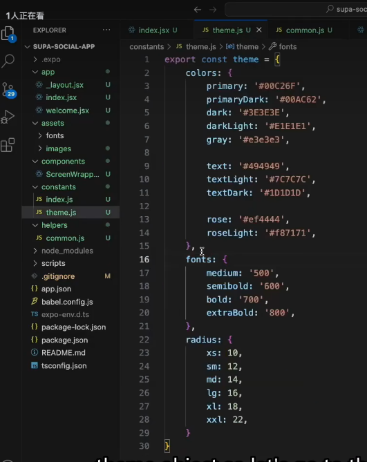
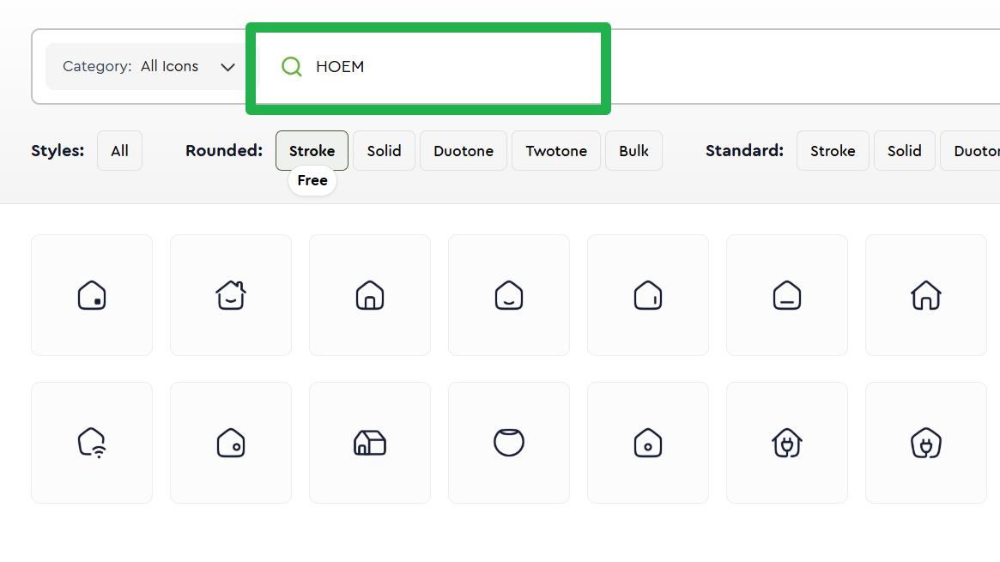
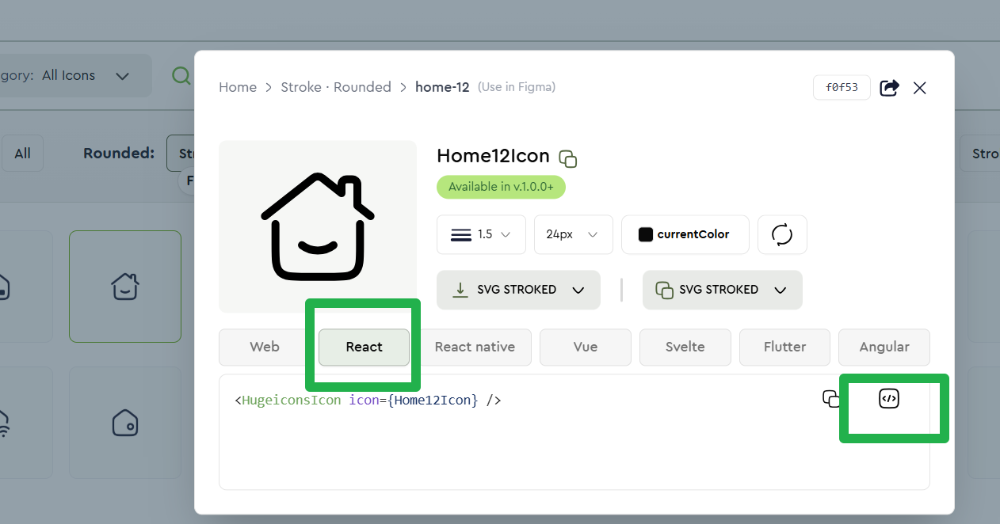
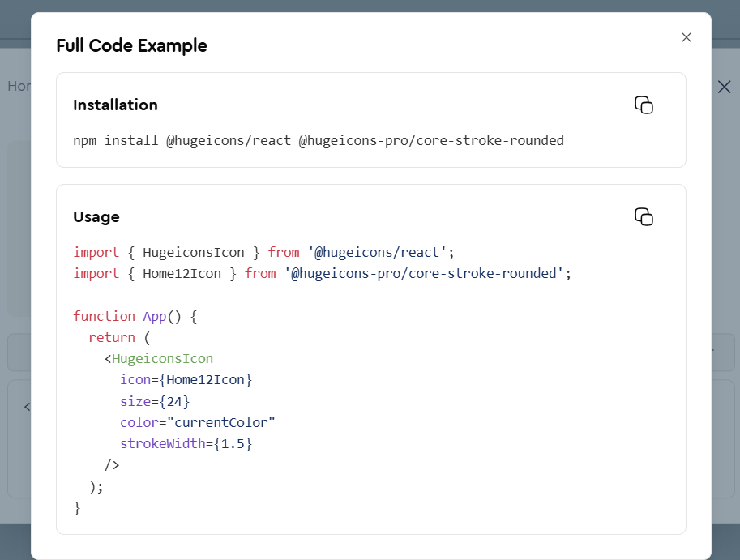
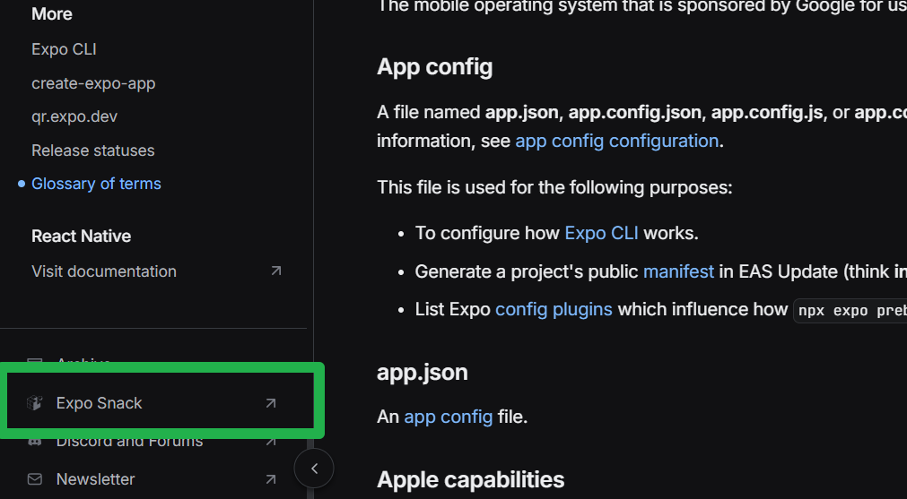
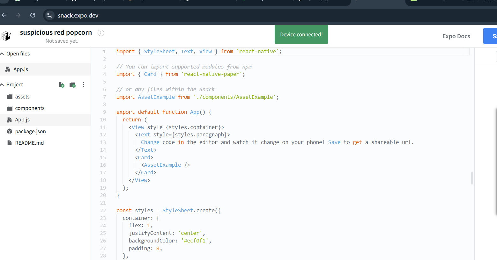

## 开发常用

创建一个 theme 文件

## 在开发中使用

1.  网站 name：hugeicons

2.  `npm install @hugeicons/react-native @hugeicons-pro/core-stroke-rounded react-native-svg`

3.  找到相应的 icon
    
    
    

## 在 web 中写项目

